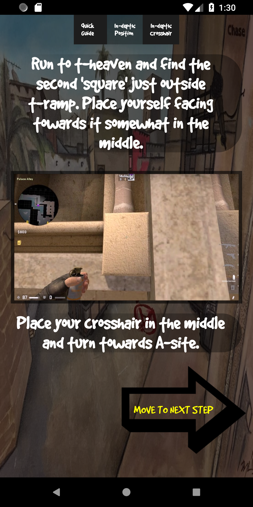

# Download  
**Android:**  
___________________________________________________________________________________________________________________________________  
(Current)  
**[- v. 1.0.0](https://github.com/bischmlb/Smokes-de_mirage/releases/download/v1.0/smokes_mirage.apk)  
___________________________________________________________________________________________________________________________________  
(Previous)  
[- v. 0.9.2](https://github.com/bischmlb/Smokes-de_mirage/releases/download/0.9b/smokes_mirage_0.9beta.apk)    
[- v. 0.9.1](https://github.com/bischmlb/CSGO_Smokes/releases/download/0.9a/app-release.apk)  
___________________________________________________________________________________________________________________________________  

# About
A smoke guide for the map de_mirage, in the game Counter-Strike: Global Offensive

The project is  a side project im doing for fun - still criticism is greatly appreciated. I am rather new to APK programming in android studio.  

Contact info:   
**mathiasbischo@gmail.com**  
or  
[**add me on steam**](https://steamcommunity.com/profiles/76561197984821742/)  
**discord: bisch#7742**

# Issues
The app has issues dealing with native changes to screen size. For optimal execution it should be run with no "screen zoom" of any kind.  
  
**Samsung Galaxy S(X):**  
Make sure your 'screenzoom' is set to 'small' (Settings > Screen > Fonttype and screenzoom > screenzoom = small) for optimal display. Buttons and text can bug out and go out of bounds if this is not set.

# Preview

